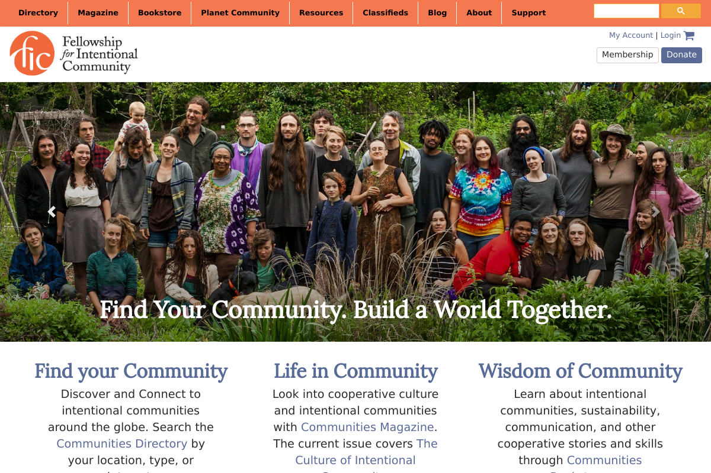

# Fellowship of Intentional Communities Wordpress Theme

[](https://travis-ci.org/Fellowship-For-Intentional-Community/Wordpress-Theme)

This is the wordpress theme used by FIC. It uses Webpack for asset compilation
& Bootstrap4 as a SASS Framework.



Right now this is mostly a port of our old Headway theme, but we are slowly
migrating to use Elm + REST & will possibly redesign various pages. We may
slowly migrate to a Haskell/Servant backend.

Right now only the Directory List pages & our Wholesale Order Form use Elm.


```
# Install Dependencies
npm i
# Build Minimized Scripts & Styles
npm run build
# Watch Source Files & Build Scripts & Styles for Development
npm run watch
```


## PHP Code Style

* Indent with 2 spaces.
* Namespace functions using classes, prefer classes that don't require
  instantiation by using static functions.
* Prefix class names with `Theme` if necessary.
* Classes with actions, filters, & shortcodes should live in the `includes/`
  subdirectory.
* Any functions used only by other methods in the class should be marked as
  private.


## Elm Code Style

* All Elm code should live in the `src` directory under as a single elm
  project. Unrelated pages should be split up by webpack entry points.
* Autoformat all code with `elm-format`.

## License

GPL-3.0
